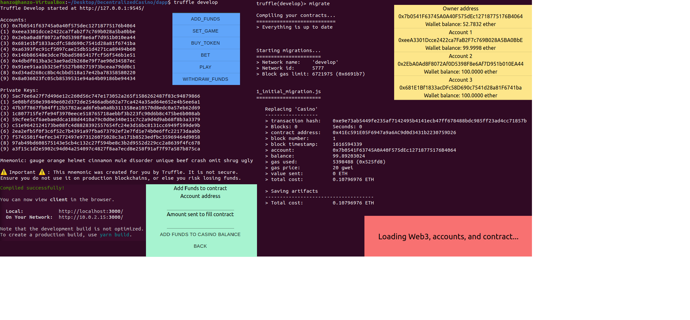

# Decentralized Casino

## Table of contents

1. [Presentation](#presentation)
2. [Project architecture](#project-architecture)
3. [How to install](#how-to-install)
4. [How to use](#how-does-it-work)
5. [Features](#Features)
6. [Links](#links)

## Presentation 

>This is a decentralized application (dapp) built on ethereum blockchain using smart contract and solidity language. After doing [cryptozombies](https://cryptozombies.io) tutorial, watching the [source code](https://github.com/hanzopgp/CryptoZombies) and taking [notes](https://github.com/hanzopgp/CryptoZombies), we are building our first dapp. The goal is to build a casino (dice game, crash game...) on the blockchain, the source code will be public so the users can see if the games are rigged. Thanks to the blockchain technology, the source code won't ever be able to change once the contracts are deployed. This means there will be no way to scam our users. The final goal is to make that app fully secured (paiments, exploits...) and optimised (so the gas fees won't be too expensive).

## Project architecture

<pre><code>
DecentralizedCasino/
├── dapp/
│   	├── contracts/                 (Contains all the backend in solidity)
│       │       ├── games/ 	       (Contains game model)   
│       │       ├── lib/               (Contains libs like safemath, ownable...)
│       │       ├── token/             (Contains the token files of the casino)
│       │       ├── Casino.sol         (Main solidity file)
│       │       ├── Utility.sol        (Contains utility functions)               
│   	├── migrations/                (Contains the js code to deploy our contracts)
│       ├── test/                      (Contains js tests files ran by truffle test command)
│       ├── build/                     (Contains the json files after being compiled for our tests)
│       ├── client/                    (Contains our frontend application)
│       │        ├── src/              (Contains contracts build and react files)
│       │        │     ├── contracts/  (Contains the json files of the compiled contracts)
│       │        │     ├── components/ (Contains the react components)
│       │        │     └── App.js      (Main javascript file of the app)
│       │        └── public/           (Contains the public frontend element like index.html)
│       └── truffle-config.js          (Contains the config for truffle, like the host and port)
├── README.md		          
├── MEMO.txt
├── TODO.txt
└── LICENCE  
</pre></code>

## How to install

- Open a terminal
- `git clone https://github.com/hanzopgp/DecentralizedCasino`
- `npm install npm@latest -g` (Installs node package manager)
- `npm install -g truffle` (Installs truffle so we can compile and migrate)
- `npm install -g hd-wallet` (Installs hd-wallet)
- `npm install -g ethereumjs-testrpc`(Installs testrpc so we can test our frontend app)
- `npm install -g tailwind`(Installs tailwind so we can do a quick css design)
- `cd DecentralizedCasino/dapp`
- `truffle unbox truffle-box-react` (Don't override anything ! Installs the truffle box in the project)
- `cd client`
- `npm install` (Installs all the dependencies)
- `npx tailwindcss-cli@latest build -o tailwind.output.css` (Builds the css files)
- `cd ..`
- `truffle develop` (Launch truffle console)
- `migrate` (Compilse and migrates your contracts)
- Open a new terminal in dapp
- `npm run start` (Runs your local server for the frontend application) 
- It should open a new window "localhost:3000"
- You can now use the decentralized casino application !

>- For the backend we used Solidity.
>- For testing purposes, we are using truffle/ganache/nodejs to deploy our smart contracts on a local blockchain, with test accounts.
>- For the frontend we used truffle react box and tailwindcss.

## Features

- Frontend application to interact with deployed contracts
- Backend casino in solidity
- Truffle tests with local blockchain
- Gas optimisation (external, view, memory, uint struct...)
- Security (SafeMath, Ownable, ERC20...)
- Payable functions
- Tokens as credits for the games (Using ERC21)

## Links

- https://www.youtube.com/watch?v=y9MnRJT__9E&ab_channel=Cryptoast
- https://en.wikipedia.org/wiki/Decentralized_application
- https://fr.wikipedia.org/wiki/Ethereum
- https://fr.wikipedia.org/wiki/Blockchain
- https://fr.wikipedia.org/wiki/Solidity
- https://cryptozombies.io/
- https://www.dappuniversity.com/
- https://www.trufflesuite.com/
- https://www.trufflesuite.com/boxes/react
- https://www.npmjs.com/package/hd-wallet
- https://www.npmjs.com/package/ethereumjs-testrpc
